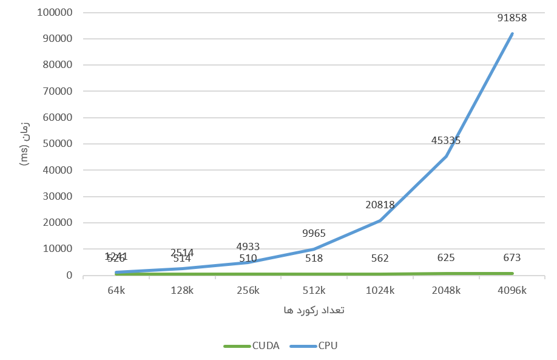
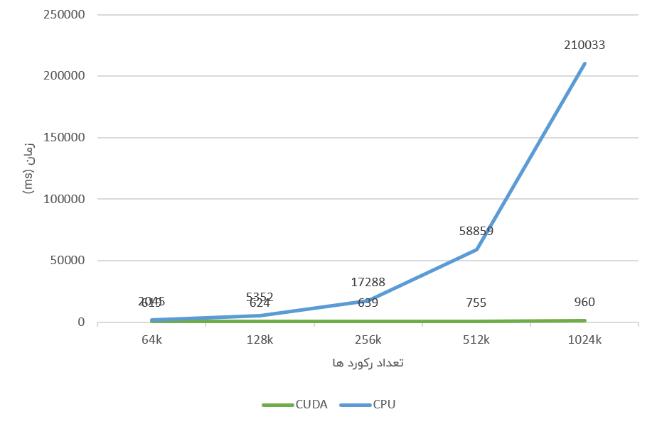
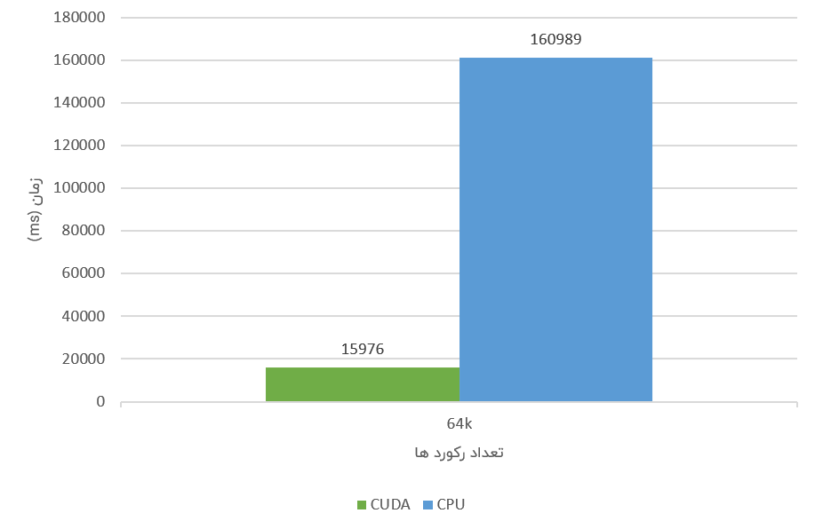

# Parrallel Database

 By: Ali Ghanbari

 Professor: Dr. Mossavi nia

 Course: Prallel Proccessing

 Operators Implemented: Restrict, Summerize, Sort

[Report](./assets/parallel_db_report.pdf)

# Benchmarks

## Restrict

## Summerize

## Sort

